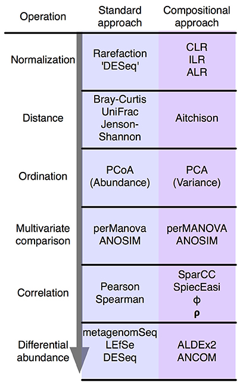

# microbiome-network-analysis-research

## Overview

This research project aims to understand how microbial compositions shift in response to carbon source perturbation. We use a Compositional Data Analysis (CoDA) approach instead of the standard microbial pipeline to gain better insight into the gradient shifts and respect the inherent compositional nature of high-throughput sequencing data.

## Theory

The steps in a standard microbiome analysis toolkit have compositional replacements.

Image Source: [Microbiome Datasets Are Compositional: And This Is Not Optional (Gloor 2017)](https://www.frontiersin.org/articles/10.3389/fmicb.2017.02224/full)

1. Normalization: Centered-Log Ratio (CLR) Transform + Aitchison Distance
2. Ordination: PCA (Variance) + Clustering Dendogram
3. Multivariate Comparison: PERMANOVA, ANOSIM 
4. Correlation: SpiecEasi
5. Differential Abundance: [ANCOM](https://www.tandfonline.com/doi/full/10.3402/mehd.v26.27663), [ALDEx2](https://journals.plos.org/plosone/article?id=10.1371/journal.pone.0067019)

### Theory References

**Compositional Data Analysis:**  
* Introduction to CoDA: [Microbiome Datasets Are Compositional: And This Is Not Optional (Gloor 2017)](https://www.frontiersin.org/articles/10.3389/fmicb.2017.02224/full)
* Support of CoDa: [Compositional Data Analysis of Microbiome and Any-Omics Datasets: A Validation of the Additive Logratio Transformation](https://www.frontiersin.org/articles/10.3389/fmicb.2021.727398/full)
* Case Study: [Compositional Data Analysis Approaches to Improve Microbiome Studies: from Collection to Conclusions](https://www.youtube.com/watch?v=j1IbfQrT2Cs)
* Tutorial: [Introduction to the Statistical Analysis of Microbiome Data in R](https://www.nicholas-ollberding.com/post/introduction-to-the-statistical-analysis-of-microbiome-data-in-r/)
* Review: [Understanding sequencing data as compositions: an outlook and review](https://academic.oup.com/bioinformatics/article/34/16/2870/4956011?login=false)
* Explanation of Correlation-Clustering: [Differential abundance analysis with gneiss](https://docs.qiime2.org/2019.4/tutorials/gneiss/)
* Tutorial on Using PERMANOVA test: [Tutorial on using adonis from the vegan R package (CC081)
](https://www.youtube.com/watch?v=1ETBgbXl-BM)
* Differential Abundance Method Comparison: [Microbiome differential abundance methods produce different results across 38 datasets](https://www.nature.com/articles/s41467-022-28034-z)
* ALDEx2 vignette: [ANOVA-Like Differential Expression tool for high throughput sequencing data](https://www.bioconductor.org/packages/devel/bioc/vignettes/ALDEx2/inst/doc/ALDEx2_vignette.html)
* Use ALDEx2 on small sample sizes: [A reproducible effect size is more useful than an irreproducible hypothesis test to analyze high throughput sequencing datasets](https://arxiv.org/pdf/1809.02623.pdf)
  * "The Ed statistic is shown to be more reproducible and robust than p-values and requires sample sizes as small as 5 to reproducibly identify differentially abundant features."
* ANCOM vignette: [ANCOM-BC](http://www.bioconductor.org/packages/release/bioc/vignettes/ANCOMBC/inst/doc/ANCOMBC.html)
* Metacoder documentation: [Diversity statistics](https://grunwaldlab.github.io/metacoder_documentation/workshop--07--diversity_stats.html)
* Compositional Analysis Practical Paper: [The Gut Microbiota of Healthy Aged Chinese Is Similar to That of the Healthy Young](https://journals.asm.org/doi/10.1128/mSphere.00327-17)
* Compositional Analysis Practical Paper: [OMNI-GUT](https://www.dnagenotek.com/us/pdf/PD-WP-00070.pdf)
* Propr Paper: [propr: An R-package for Identifying Proportionally Abundant Features Using Compositional Data Analysis](https://www.nature.com/articles/s41598-017-16520-0)
* Propr GitHub: [tpq/propr](https://github.com/tpq/propr)
* Propr Documentation [Package ‘propr’](https://cran.r-project.org/web/packages/propr/propr.pdf)

**Other Resources:**
* Comparison for methods of variable selection (selbal, clr-lasso, coda-lasso): [Variable selection in microbiome compositional data analysis](https://academic.oup.com/nargab/article/2/2/lqaa029/5836692)
* Visualization Options: [Exploring the Microbiome Analysis and Visualization Landscape](https://www.frontiersin.org/articles/10.3389/fbinf.2021.774631/pdf)

**PERMANOVA vs. ANOSIM:**  

If you have very different group sizes, you may consider analysis of similarities (ANOSIM) instead of PERMANOVA. This test does not assume equal group variances. However, it only allows simple 1 variable models with no interactions and can only be used for categorical (AgeGroup), not continuous (ADG) variables. So, ANOSIM has a lot of limitations and should only be used if you group sizes are very, very different, like 10 vs 100.
([Source](https://rstudio-pubs-static.s3.amazonaws.com/343284_cbadd2f3b7cd42f3aced2d3f42dc6d33.html))

## Code Overview

### Format Data Files (`format.ipynb`)

**Dependencies:**
* [skbio](http://scikit-bio.org/)
* pandas, numpy, re

**Run:**  
`jupyter notebook scripts/process_data.ipynb`

**Input:**

* `data/raw/sample_names.csv`
  * Mapping from generated sample ID to renamed sample IDs
* `data/raw/081616JHnew515Fcomplete-pr.fasta.otus.fa.OTU.txt`
  * OTU ID, taxonomy x Sample ID x Absolute Counts 
* `data/raw/FCF_annotations.csv`
  * Sample ID x Meta Information

**Output:**

* `data/processed/sample_metadata.tsv`
  * Sample ID x Meta Information
* `data/processed/OTU_counts.tsv`
  * OTU ID x Sample ID x Absolute Counts
* `data/processed/feature_metadata.tsv`
  * OTU ID x Taxonomy

### Ordination (`ordination.Rmd`)

Bar Chart, sample groups
* raw counts (class)
* relative abundance (class, phylum)
* centered log ratio (class)

Dendogram, samples
* aitchison (series, cluster)
* bray-curtis (series, cluster)

PCA, samples
* aitchison (all, cellulose)
* bray-curtis (all, cellulose)

From Ward distance hierarchial correlation clustering on CLR values, identified strong clusters
* top 3 high-level clusters recorded in `data/raw/cluster_decisions.csv`

### Multivariate Comparison (`multivariate_comparison.Rmd`)

Bar Chart, sample clusters
* raw counts (class)
* relative abundance (class, phylum)

PCA, samples
* aitchison (all)

PERMANOVA

| name | P | Disp | R2 |
| ----- | ----- | ----- | ----- |
| all -- cluster | *** | 0.939 | 0.25283 |
| pairwise -- early vs. recovering | *** | 0.632 | 0.19428 |
| pairwise -- early vs. stable | *** | 0.824 | 0.21769 |
| pairwise -- recovering vs. stable | *** | 0.92 | 0.19261 |
| all -- focused.cluster | \*\*\* | \*\*\* | 0.41679 |
| early -- focused.cluster | \*\*\* | \*\*\* | 0.2369 |
| pairwise -- perturbed G vs. perturbed M | *** | . | 0.32278 |
| recovering -- focused.cluster | *** | 0.499 | 0.20343 |
| pairwise -- recovering G vs. recovering M | ** | 0.283 | 0.13335 |
| pairwise -- recovering G vs. recovering C | *** | 0.932 | 0.15766 |
| pairwise -- recovering C vs. recovering M | *** | 0.296 | 0.375 |
| stable -- focused.cluster | *** | 0.213 | 0.23358 |
| pairwise -- stable G vs. stable M | ** | 0.696 | 0.14746 |
| pairwise -- stable C vs. stable M | ** | 0.719 | 0.14746 |
| pairwise -- stable G vs. stable C | *** | . | 0.18258 |

Signif. codes:  0 '\*\*\*' 0.001 '\*\*' 0.01 '*' 0.05 '.' 0.1 ' ' 1

### Differential Abundance (`differential_abundance.Rmd`)

Tools
* ALDEx2
* ANCOM
* metacodr (visualize heat map tree)

